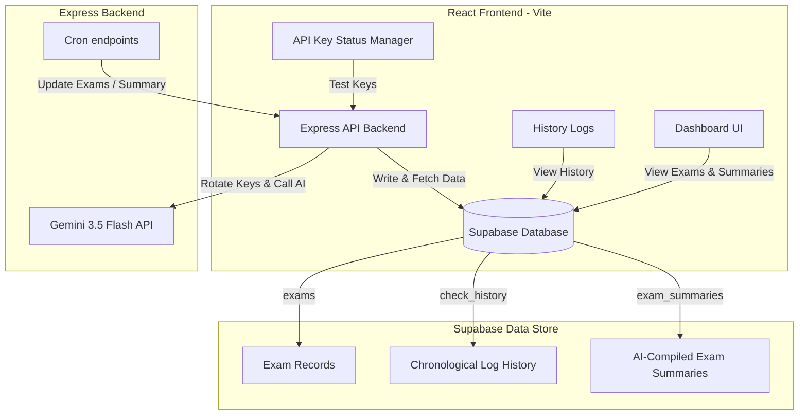

# 🎓 Exam Notification Tracker (AI-Powered)

An automated, intelligent tracking system for government, banking, and IT recruitment exams in India. This project leverages the **Gemini 3.5 Flash** model with a robust multi-key rotation mechanism to regularly scan, check, and summarize exam notifications, storing historical updates in **Supabase** and displaying them in a sleek, glassmorphic **React** dashboard.

---

## 🏗️ System Architecture

The project is structured as a monorepo consisting of a Node.js Express backend and a React (Vite) frontend, communicating with a Supabase database.



---

## 🌟 Key Features

*   **Intelligent Exam Tracking**: Automated checks on Indian government, bank, and IT exams using generative AI to determine current status, expected dates, and details.
*   **Gemini API Multi-Key Rotation**:
    *   *Cyclic Key Rotation*: Sequentially loops through all available keys (`GEMINI_API_KEY*`) to distribute request loads.
    *   *Fallback Pipeline*: Gracefully recovers from key failures (rate limits `429`, server errors `503`) by attempting retries and switching to fallback keys.
*   **Database Synchronization**: Keeps track of current exam states, keeps an audit log of previous runs, and saves consolidated AI summaries in Supabase.
*   **Interactive React Dashboard**:
    *   Premium dark-themed visual design with CSS grid layouts and smooth hover effects.
    *   Interactive cards that open detailed modal windows showing the AI-compiled summaries (conducting body, role, eligibility, expected dates, salary, etc.).
    *   **API Key Manager**: A built-in page to test key status and inspect which environment-configured keys are working, rate-limited, or bad.
    *   **History Logs**: A list of the latest 200 history logs showing previous runs and debugging details (e.g., successful/unsuccessful key hits).

---

## 📂 Project Structure

```
ProjectForNotification/
├── backend/
│   ├── src/
│   │   ├── config/          # Database (Supabase) & environment configuration
│   │   ├── controllers/     # API route handlers
│   │   ├── middlewares/     # Error handler and authentication middleware
│   │   ├── routes/          # Express route definitions
│   │   └── services/        # Business logic (Gemini rotation, exam checks, and cron runs)
│   └── server.js            # Express server entry point
├── frontend/
│   ├── src/
│   │   ├── components/      # Reusable UI parts (e.g., Navbar)
│   │   ├── pages/           # Pages (Dashboard, ApiKeys, History)
│   │   ├── globals.css      # Dark mode glassmorphic styling
│   │   ├── main.jsx         # React application entry point
│   │   └── supabaseClient.js# Supabase Client configuration
│   └── vite.config.js       # Vite configuration
├── supabase_setup.sql       # Database SQL schema for exams and history
├── summary_setup.sql        # Database SQL schema for consolidated summaries
├── package.json             # Root-level scripts for dev/prod management
└── .env.example             # Env templates
```

---

## 🗄️ Database Schema

The database consists of three main tables linked together in Supabase:

### 1. `exams`
Stores the target exams to track.
*   `id` (UUID, Primary Key)
*   `name` (Text, Unique) - e.g. *SBI PO*, *IBPS SO*, *SSC CGL*
*   `category` (Text)
*   `status` (Text) - `Upcoming` | `Announced` | `Ongoing` | `Unknown`
*   `expected_date` (Text)
*   `details` (Text)
*   `last_checked_at` (Timestamp)
*   `is_retrying` (Boolean)

### 2. `check_history`
Stores raw logs of each scan.
*   `id` (UUID, Primary Key)
*   `exam_id` (UUID, ForeignKey references `exams.id`)
*   `status` (Text)
*   `expected_date` (Text)
*   `details` (Text)
*   `is_correct` (Boolean)
*   `checked_at` (Timestamp)

### 3. `exam_summaries`
Stores unified summaries parsed into structured JSON parameters.
*   `id` (UUID, Primary Key)
*   `exam_id` (UUID, ForeignKey references `exams.id`, Unique)
*   `concise_text` (Text, containing structured JSON format):
    ```json
    {
      "examName": "Full Name",
      "conductingBody": "Conducting Body",
      "postName": "Target Post Name",
      "eligibility": "Eligibility requirements",
      "notificationStatus": "Announced / Expected",
      "expectedNotificationDate": "Expected release date",
      "expectedExamDate": "Expected exam date",
      "applicationDeadline": "Deadline date or N/A",
      "officialWebsite": "URL",
      "summary": "AI Consolidated update description paragraph"
    }
    ```
*   `last_updated_at` (Timestamp)

---

## ⚙️ Setup and Installation

### 1. Database Setup
Execute the SQL commands in [supabase_setup.sql](file:///c:/Users/jalaj/OneDrive/Desktop/ProjectForNotification/supabase_setup.sql) and [summary_setup.sql](file:///c:/Users/jalaj/OneDrive/Desktop/ProjectForNotification/summary_setup.sql) inside your Supabase SQL Editor.

### 2. Environment Configuration
Create a `.env` file in the root directory following the [.env.example](file:///c:/Users/jalaj/OneDrive/Desktop/ProjectForNotification/.env.example) template:

```env
# Supabase Configuration
NEXT_PUBLIC_SUPABASE_URL=https://your-project-id.supabase.co
NEXT_PUBLIC_SUPABASE_ANON_KEY=your-supabase-anon-key

# Gemini API Keys (Supply multiple keys for auto-rotation)
GEMINI_API_KEY=primary_api_key
GEMINI_API_KEYForConsisingData=fallback_api_key_1
GEMINI_API_KEY_3=fallback_api_key_2
GEMINI_API_KEY_4=fallback_api_key_3

# Optional Configuration
PORT=5000
```

### 3. Run Locally

Install all dependencies recursively in both the frontend and backend folders:
```bash
npm run install-all
```

Start both the Vite dev server and Express backend concurrently:
```bash
npm run dev
```

The app will be running at:
*   Frontend: [http://localhost:5173](http://localhost:5173) (or the next available port shown by Vite)
*   Backend: [http://localhost:5000](http://localhost:5000)

---

## ⏱️ Background Jobs (Cron Routes)

You can trigger updates by invoking the following backend routes:

*   **Exam Status Checker**: `GET /api/cron`
    *   Iterates over the exams database and requests status updates using cyclic Gemini API key rotation.
*   **Summarizer Compilation**: `GET /api/cron-summary`
    *   Gathers check history logs for an exam and runs a synthesis request to construct a consolidated JSON update summary.
